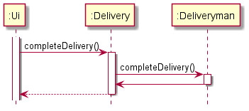

# Developer Guide

 ## Introduction 
 ### What is Diliveri
Diliveri is desktop application built on Java and has cross platform abilities across different operating systems. 
With the rise of demand for deliveryman due to the pandemic, this app optimises the delivery route for each delivery 
man taking into account the number of deliveries per location and distances between locations, we improve the time and 
efficiency of deliveries. This app aims to be a one stop solution and more for to meet all the needs of a deliverymen.  

## Design & implementation
### [Implementation] : Feature [1]

### [Implementation] : Recording Completed Deliveries

Most deliverymen would want an overall outlook of completed deliveries, so that they would
be able to see and judge exactly how much they have earned over the course of their delivery spree.

The primary class involved in executing this function is `Deliveryman`.

Whenever a `Delivery` is marked as completed by the user, the `Ui` class will call
the `completeDelivery()` method which accepts a delivery number (the index of the
delivery), and a Deliveryman object.

The `completeDelivery()` will mark the Delivery as completed in the delivery list. 
Subsequently, another `completeDelivery()` method is called, and this method will add 
the completed delivery to a list of completed deliveries (`records`) attributed to the deliveryman.

When the `record` command is given, the `showRecords()` method is called which calls the `getRecords()` method
of the `Deliveryman` class.
an arraylist of Delivery objects  object. This method will simply print a formatted list of all the items in `records`

This sequence of program flow was chosen because it would still allow for the proper abstraction of the classes.
In this particular case, the `Ui` class is only handling the User Interface aspect of code execution. Similarly,
the `Delivery` class is not especially involved in the `Deliveryman`'s `records`. The code directly changing the deliveryman's
`records` is present only in the `Deliveryman` class.

### [Implementation] : Retrieving Delivery Details

The controllerForCommandsAndArguments() inside out `Controller` will call the `Ui`'s `processViewDelivery()` method,
which will then select the relevant `Delivery` to be examined, and finally the `showDeliveryDetails()` method
loops through all items inside the `Delivery` and prints details about each item

### [Implementation] : List Assigned Deliveries

All deliverymen would want have a list of deliveries that are assigned to them so that they would be able to get an 
overview delivery jobs that have on that day.

The primary class involved executing this function is `Delivery`.

Whenever the user request for the delivery list, the `Ui` class will call the `showDeliveryList()` method. 

The `showDeliveryList()` in Delivery then subsequently retrieve the list of deliveries from the static variable 
`DeliveryList.deliveries`. This static variable contains the list of completed and uncompleted deliveries. 

Having obtained the list of deliveries, the program will iterate through this list of `Delivery` objects and calls the 
`toString()` method that has been overridden in the `Delivery` class. The `toString()` method has been overridden 
specifically to return a formatted string that includes `deliveryID`,  `DeliveryStatusSymbol`, `Address` and `Recipient`
information for each delivery job. 

The sequence of program flow was chosen as it allows for proper abstraction of the classes. The `Ui` class will only 
handle the User Interface aspect of the code execution. 

The general interaction between the abovementioned classes are briefly illustrated in the sequence diagram
shown below. 

## Product scope

The usage of this app is primarily restricted to Deliverymen making use of the capabilities of this application.
This application will heavily rely on external information regarding the delivery assignments for the deliverymen,
but for the purpose of v2.1 we have taken the liberty of loading dummy data into the Delivery.txt and Routes.txt files.
The contents of all the files are not to be manually modified, or the program will likely not work as described.

### Target user profile

Our target audience are deliverymen that are familiar with using an application with a command
line interface. Deliverymen will use Diliveri to quickly and efficiently track and complete
their deliveries

### Value proposition

Deliverymen are oftentimes unable to accurately track their deliveries - and more often than
not like a reliable platform to easily consolidate their deliveries. Diliveri enables deliverymen to
load their delivery assignments into the application, allowing increased flexibility and
ease of use for deliverymen around the world

## User Stories

|Version| As a ... | I want to ... | So that I can ...|
|--------|----------|---------------|------------------|
|v1.0|new user|see usage instructions|refer to them when I forget how to use the application|
|v1.0|user|load up my assigned list of deliveries|see what deliveries I need to complete|

## Non-Functional Requirements

{Give non-functional requirements}

## Glossary

* *glossary item* - Definition

## Instructions for manual testing

{Give instructions on how to do a manual product testing e.g., how to load sample data to be used for testing}
